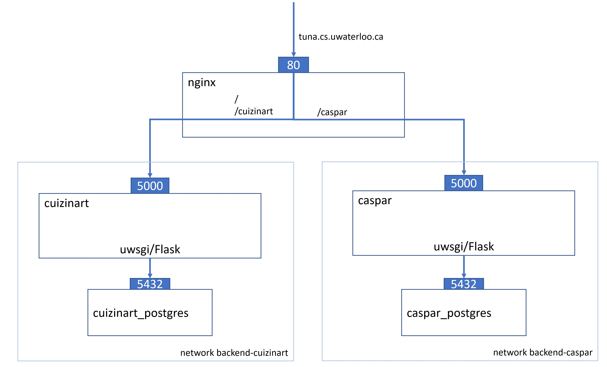

# production
This repository contains the configurations to run Cuizinart and CaSPAr in a production environment.

Here, the docker-compose.yaml defines the containers for nginx, cuizinart, caspar, and their databases.
nginx will route requests to `tuna.cs.uwaterloo.ca` and `tuna.cs.uwaterloo.ca/cuizinart` to the cuizinart container, and requests to `tuna.cs.uwaterloo.ca/caspar` to the caspar container.

The contents of the cuizinart and caspar containers are defined in the respective production branches in https://github.com/gwf-uwaterloo/cuizinart.

## Run
- Create a `.env` file with the following configuration options:

|Name|Value|Explanation|
|---|---|---|
|LOG_DIRECTORY|`<path>`|Directory to put log files. Needs to contain subdirectories `cuizinart` and `caspar`.|
||||
|SSH_KEYFILE_PATH|`<path_to_keyfile>`|Path to keyfile (generated through `ssh-keygen`) for above user|
|SSH_KNOWN_HOSTS_PATH|`<path_to_file>`|Path to `known_host` file that will be mapped into Cuizinart container so `scp` to Graham works immediately|
||||
|POSTGRES_USER|`<user>`|Username of postgres db|
|POSTGRES_PW|`<pwd>`|Password of postgres user|
|POSTGRES_DB|`cuizinart`|Name of postgres db|
|DB_MIGRATIONS_FOLDER|`<path>`|Folder to mount into cuizinart/caspar container that will contain migrations files. Needs to contain subdirectories `cuizinart` and `caspar`.|
||||
|NC_INPUT_PATH|`<path to NetCDF files>`|Path to NetCDF input files|

- For initial setup of the Let's Encrypt certificates, run `./init-letsencrypt.sh` (only needed once)
- Run `docker-compose up` or start containers `nginx`, `certbot`, `cuizinart`, `caspar`, `(cuizinart/caspar)_postgres`, `pyspark` as needed. nginx will serve on `tuna.cs.uwaterloo.ca`.

## System setup

